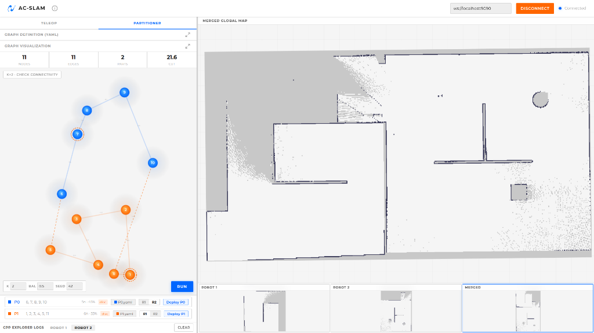

<div align="center">


# AC-SLAM Mission Control

### Multi-Agent Mobile Robot System for Active Collaborative SLAM

[](https://docs.ros.org/en/humble/)
[](https://www.python.org/)
[](https://developer.mozilla.org/en-US/docs/Web/JavaScript)
[](LICENSE)
[](https://vitejs.dev/)

---

*A web-based mission control interface for real-time teleoperation, map visualization, graph-based environment partitioning, and multi-robot task deployment — built on top of ROS 2 and rosbridge.*

</div>

---

## Overview

**AC-SLAM Mission Control** is a browser-based platform designed to **control robots** performing Active Collaborative Simultaneous Localization and Mapping (AC-SLAM). It provides a unified mission control dashboard that connects to ROS 2 via WebSocket (rosbridge), enabling operators to teleoperate multiple robots, visualize occupancy grid maps in real-time, partition environments using graph theory, and deploy coordinated exploration tasks.

This repository serves as the **control interface** for robots running in:

| Environment | Repository |
|:---|:---|
| **Simulation** | [Sim-AC-SLAM](https://github.com/Aymen-Jocef/Sim-AC-SLAM) |
| **Real World** | [Real-AC-SLAM](https://github.com/Aymen-Jocef/Real-AC-SLAM) |

> [!NOTE]
> This platform was tested with **ROS 2 Humble Hawksbill** on Ubuntu 22.04. Compatibility with other ROS 2 distributions has not been verified.

---

## Screenshot

<div align="center">



*AC-SLAM Mission Control — Partitioner mode with graph visualization, merged global map, and per-robot occupancy grids.*

</div>

---

## About

> **Multi-Agent Mobile Robot System for Active Collaborative SLAM Application**
>
> This platform was developed as part of an Engineering Thesis by **Ferroukhi Khaled** and **Meddas Aymen**, presented in 2026 at the *École Nationale Polytechnique* (ENP), Algiers.
>
> The system enables real-time teleoperation and coordinated exploration of multiple autonomous mobile robots performing simultaneous localization and mapping (SLAM). It provides an integrated mission control interface for map visualization, graph-based environment partitioning, and multi-robot task deployment.
>
> *École Nationale Polytechnique · Department of Electronics*

---

## Features

<table>
<tr>
<td width="50%">

### Teleoperation
- 8-directional D-pad control with keyboard shortcuts
- Holonomic & differential drive modes
- Adjustable linear and angular speed
- Real-time velocity readout (vx, vy, ω)
- Per-robot tab switching

</td>
<td width="50%">

### Map Visualization
- Real-time occupancy grid rendering via ROS topics
- Merged global map display
- Per-robot individual map thumbnails
- Click-to-focus map switching
- Pan, zoom, and rotate controls

</td>
</tr>
<tr>
<td>

### Graph Partitioning
- YAML-based graph definition editor
- Interactive graph visualization on canvas
- Configurable partitioning parameters (k, balance, seed)
- Color-coded partition display with statistics
- Connectivity checking (k-connectivity)

</td>
<td>

### Task Deployment
- One-click deployment of exploration tasks per partition
- ROS 2 node launching from the browser (via Python backend)
- Live CPP Explorer log streaming (SSE)
- Per-robot process management (start/stop)

</td>
</tr>
</table>

---

## Prerequisites

Before running the platform, ensure you have the following installed:

| Requirement | Version | Notes |
|:---|:---|:---|
| **Ubuntu** | 22.04 LTS | Tested OS |
| **ROS 2** | Humble Hawksbill | Required for robot communication |
| **Python** | 3.10+ | For the backend server |
| **Node.js** | 18+ | For the Vite development server |
| **npm** | 9+ | Package manager |
| **rosbridge_suite** | ROS 2 Humble | WebSocket bridge for ROS |

---

## Getting Started

### 1. Install rosbridge

Install the `rosbridge_suite` package for ROS 2 Humble:

```bash
sudo apt install ros-humble-rosbridge-suite
```

### 2. Launch the rosbridge WebSocket Server

Open a terminal and start the rosbridge WebSocket server:

```bash
ros2 launch rosbridge_server rosbridge_websocket_launch.xml
```

> [!TIP]
> By default, rosbridge listens on `ws://localhost:9090`. The platform's connection input is pre-filled with this address.

### 3. Run the Python Backend Server

In another terminal, navigate to the project directory and start the backend server:

```bash
cd acslam_platform
python3 server.py
```

This starts a threaded HTTP server on **port 8000** that:
- Serves the static frontend files
- Handles YAML file saving for graph partitions
- Launches ROS 2 `cpp_explorer` nodes for each robot
- Streams live exploration logs via Server-Sent Events (SSE)

### 4. Open the Platform

Open your browser and navigate to:

```
http://localhost:8000
```

> [!IMPORTANT]
> Make sure the rosbridge WebSocket server (Step 2) is running **before** connecting from the platform. The platform will prompt you to enter the WebSocket URL on startup.

---

## Dependencies

### System Dependencies

```bash
# ROS 2 Humble (full desktop install or base + required packages)
sudo apt install ros-humble-desktop

# rosbridge suite (WebSocket bridge)
sudo apt install ros-humble-rosbridge-suite
```

### Python Dependencies

The backend server uses only **Python standard library** modules — no additional pip packages required:

- `http.server` — HTTP request handling
- `socketserver` — Threading support
- `json` — JSON parsing
- `subprocess` — ROS 2 node launching
- `threading` — Concurrent request handling
- `signal` — Process management

### Frontend Dependencies

| Package | Version | Purpose |
|:---|:---|:---|
| [roslibjs](http://wiki.ros.org/roslibjs) | Bundled | ROS JavaScript client library |
| [Vite](https://vitejs.dev/) | ^6.0 | Development server & build tool |
| [Montserrat Font](https://fonts.google.com/specimen/Montserrat) | Google Fonts | Application typography |

Install frontend dev dependencies:

```bash
npm install
```

### ROS 2 Topics Used

| Topic | Type | Description |
|:---|:---|:---|
| `/robot1/cmd_vel` | `geometry_msgs/Twist` | Robot 1 velocity commands |
| `/robot2/cmd_vel` | `geometry_msgs/Twist` | Robot 2 velocity commands |
| `/robot1/map` | `nav_msgs/OccupancyGrid` | Robot 1 occupancy grid map |
| `/robot2/map` | `nav_msgs/OccupancyGrid` | Robot 2 occupancy grid map |
| `/merged_map` | `nav_msgs/OccupancyGrid` | Merged global occupancy grid |

---

## Tested Environment

| Component | Details |
|:---|:---|
| **OS** | Ubuntu 22.04 LTS |
| **ROS 2 Distribution** | Humble Hawksbill |
| **Browser** | Google Chrome 120+, Firefox 120+ |
| **Python** | 3.10.12 |
| **Node.js** | 18.x / 20.x |

> [!WARNING]
> This platform has been tested and validated exclusively on **ROS 2 Humble**. Other ROS 2 distributions (Iron, Jazzy, etc.) may work but are untested.

---


## Project Structure

```
acslam_platform/
├── index.html              # Main application entry point
├── server.py               # Python backend (HTTP + SSE log streaming)
├── package.json            # Node.js project config (Vite dev server)
├── css/
│   └── main.css            # Complete application stylesheet
├── js/
│   ├── app.js              # Application bootstrap & module orchestration
│   ├── connection.js       # ROS WebSocket connection manager
│   ├── teleop.js           # Teleoperation controls & keyboard bindings
│   ├── map_viewer.js       # Occupancy grid map rendering engine
│   └── partitioner.js      # Graph partitioning & deployment logic
├── lib/
│   └── roslib.min.js       # roslibjs — ROS JavaScript client library
├── images/
│   ├── acslam_logo.png     # Application logo
│   ├── robot1.png          # Robot 1 reference image
│   └── robot2.png          # Robot 2 reference image
├── yaml/                   # Auto-generated YAML files for deployed graphs
└── config/                 # Configuration files
```

---

## Contributors

<table>
<tr>
<td align="center">
<a href="https://github.com/Aymen-Jocef/">

<br />
<sub><b>Aymen Meddas</b></sub>
</a>
</td>
<td align="center">
<a href="https://github.com/TheHiCore/">

<br />
<sub><b>Khaled Ferroukhi</b></sub>
</a>
</td>
</tr>
</table>

---

## Related Repositories

| Repository | Description |
|:---|:---|
| [Sim-AC-SLAM](https://github.com/Aymen-Jocef/Sim-AC-SLAM)  | Simulation environment for multi-agent AC-SLAM |
| [Real-AC-SLAM](https://github.com/Aymen-Jocef/Real-AC-SLAM) | Real-world implementation with physical robots |

---

## License

This project was developed as part of an Engineering Thesis at **École Nationale Polytechnique (ENP), Algiers** — Department of Electronics, 2026.

---

<div align="center">

**Built with love for robotics research**

*École Nationale Polytechnique · Department of Electronics · 2026*

</div>
